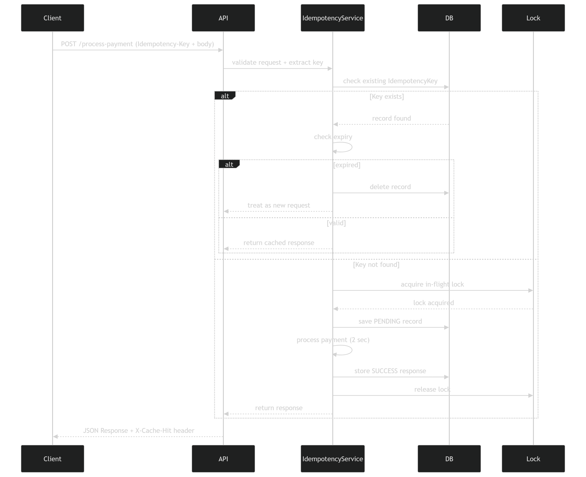

# FinSafe Idempotency Gateway

## Overview

FinSafe Idempotency Gateway is a Django-based payment processing API designed to prevent duplicate transactions caused by network failures, client retries, and concurrent requests.

In real-world payment systems, a client may resend the same payment request if a response is delayed or lost. Without protection mechanisms, this can result in customers being charged multiple times for the same transaction.

This project implements an idempotency layer that guarantees a payment request is processed only once for a given idempotency key while safely replaying the original response for duplicate requests.

The solution includes:

* Idempotency key validation
* Request payload verification
* Response caching
* Race condition protection
* In-flight request handling
* Idempotency key expiration (TTL)
* Duplicate transaction prevention

---

# Architecture Diagram

## Sequence Diagram



The sequence diagram illustrates how a payment request flows through the system.

### Flow Summary

1. Client sends a payment request with an `Idempotency-Key`.
2. The API validates the request payload.
3. The Idempotency Service checks whether the key already exists.
4. If the key exists:

   * The system verifies that the request body matches the original request.
   * If the key has expired, it is rejected.
   * If valid, the previously stored response is returned immediately.
5. If the key does not exist:

   * A lock is acquired to prevent concurrent processing.
   * The payment is processed.
   * The response is stored in the database.
   * The lock is released.
6. The API returns the response to the client.

---

## Flowchart


The flowchart provides a high-level overview of the decision-making process performed during request handling.

---

# Setup Instructions

## Prerequisites

Ensure the following are installed:

* Python 3.12+
* Django
* Django REST Framework
* Virtual Environment (venv)

---

## Clone the Repository

```bash
git clone <repository-url>
cd finsafe
```

---

## Create and Activate Virtual Environment

Windows:

```bash
python -m venv venv
venv\Scripts\activate
```

Linux/macOS:

```bash
python -m venv venv
source venv/bin/activate
```

---

## Install Dependencies

```bash
pip install -r requirements.txt
```

---

## Apply Database Migrations

```bash
python manage.py makemigrations
python manage.py migrate
```

---

## Start the Development Server

```bash
python manage.py runserver
```

Server will be available at:

```text
http://127.0.0.1:8000/
```

---

# API Documentation

## Health Check Endpoint

### Request

```http
GET /api/health
```

### Response

```json
{
  "status": "OK",
  "service": "Idempotency Gateway",
  "version": "1.0.0"
}
```

---

# Process Payment Endpoint

### Request

```http
POST /api/process-payment
```

### Required Headers

```http
Idempotency-Key: payment-123
Content-Type: application/json
```

### Request Body

```json
{
  "amount": 100,
  "currency": "GHS"
}
```

---

## Successful Payment

### Response

```json
{
  "status": "Charged 100 GHS",
  "transaction_id": "TXN-ABC123XYZ",
  "amount": "100",
  "currency": "GHS",
  "processed_at": "2026-06-04T10:00:00Z"
}
```

### Status Code

```http
200 OK
```

---

## Duplicate Request

When the same idempotency key and payload are submitted again:

### Response

The exact original response is returned.

### Additional Header

```http
X-Cache-Hit: true
```

This indicates the payment was not processed again and the stored response was replayed.

---

## Different Payload Using Existing Key

### Request

Same key but different payment details.

### Response

```json
{
  "error": "Idempotency key already used for a different request body"
}
```

### Status Code

```http
422 Unprocessable Entity
```

---

## Expired Idempotency Key

### Response

```json
{
  "error": "Idempotency key expired"
}
```

### Status Code

```http
410 Gone
```

---

# Design Decisions

This section explains the key architectural choices made during implementation.

## 1. Idempotency Keys

An idempotency key uniquely identifies a payment request.

This allows clients to safely retry requests without risking duplicate charges.

Benefits:

* Prevents duplicate transactions
* Supports safe retries
* Improves payment reliability

---

## 2. Request Body Hashing

Each request body is hashed using SHA-256.

The hash is stored and compared whenever the same idempotency key is reused.

Benefits:

* Prevents malicious key reuse
* Detects payload tampering
* Preserves transaction integrity

---

## 3. Response Persistence

Successful responses are stored in the database.

When a duplicate request arrives, the stored response is returned immediately.

Benefits:

* Faster duplicate request handling
* Consistent responses
* Reduced processing overhead

---

## 4. In-Flight Locking

The system uses an in-flight lock mechanism to handle concurrent requests.

If two identical requests arrive simultaneously:

* Only one request performs payment processing.
* The second request waits for completion.
* The completed response is returned to both clients.

Benefits:

* Prevents race conditions
* Ensures exactly-once processing
* Improves consistency

---

## 5. Database Indexing

Indexes are added on frequently queried fields such as:

* idempotency_key
* created_at
* expires_at

Benefits:

* Faster lookups
* Improved scalability
* Better database performance

---

# Developer's Choice Feature: Idempotency Key Expiration (TTL)

## Motivation

In production payment systems, idempotency keys should not remain valid indefinitely.

If keys never expire:

* Old transactions can be replayed indefinitely.
* Databases grow continuously.
* Security risks increase.

To address these concerns, an expiration mechanism was introduced.

---

## Implementation

Each idempotency record stores an expiration timestamp.

Example:

```python
expires_at = timezone.now() + timedelta(minutes=10)
```

Whenever a request is received:

1. The system checks whether the key exists.
2. The expiration timestamp is validated.
3. Expired records are rejected and removed.
4. Valid records continue through normal idempotency checks.

---

## Benefits

### Security

Limits replay attacks by preventing reuse of old transaction identifiers.

### Scalability

Reduces unnecessary growth of stored idempotency records.

### Operational Efficiency

Keeps active records relevant while allowing old records to be cleaned up.

### Industry Alignment

This approach mirrors practices used in modern payment platforms such as:

* Stripe
* PayPal

---